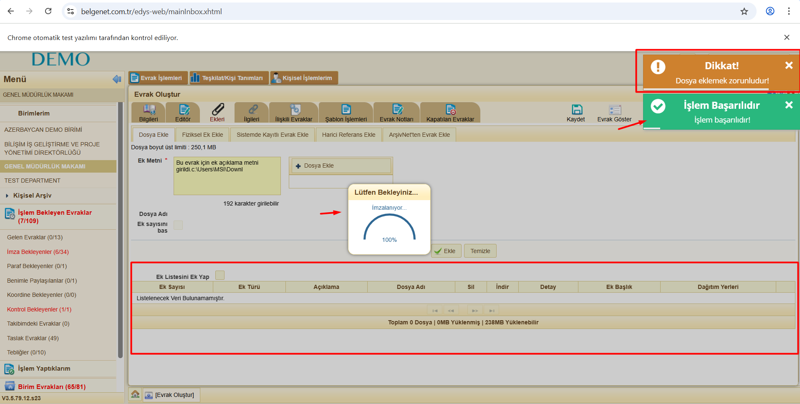

# Çalışma 1- Angle Measurement Feature

Bu proje, verilen gereksinimlere uygun olarak Gherkin dilinde hazırlanmış test senaryolarını içerir.  

## İçerik
- `features/AngleMeasurement.feature`: Gereksinimlere uygun senaryolar
- `steps/angleSteps.js`: Dosya oluşturulmuş ancak içi boş bırakılmıştır. Step definition’lar uygulamanın HTML/CSS yapısına göre uyarlanmalıdır.
- `README.md`: Açıklama ve kullanım notları

## Not
- Senaryolar Playwright + Cucumber entegrasyonu için kullanılabilir.
- Step definition’lar uygulamanın HTML/CSS yapısına göre uyarlanmalıdır.
- Gereksinim dokümanında bu detaylar verilmediği için dosya yalnızca Gherkin senaryolarını içermektedir.


# Çalışma 2 - Kayıt İşlemi Çözüm Dokümanı İncelemesi

Bu rapor, verilen kayıt işlemi çözüm dokümanındaki eksik ve çelişkili noktaları test adımlarının netliği açısından değerlendirmek amacıyla hazırlanmıştır.

---

## 📋 Eksik / Çelişkili Noktalar Tablosu

| Bileşen | Eksik / Çelişkili Nokta | Açıklama / Teste Etkisi |
|---------|--------------------------|--------------------------|
| **Tanıtım No** | Minimum karakter sınırı belirtilmemiş | Maksimum 20 hane var ama minimum kaç hane girilmeli net değil. |
| **Adı Soyadı/Unvanı** | Maksimum uzunluk belirtilmemiş | Çok uzun girişlerde sistem davranışı belirsiz. |
| **Baba Adı** | Kısıtlar belirtilmemiş | Boş bırakılabilir mi, minimum/maximum uzunluk var mı? |
| **Başlangıç / Bitiş Kayıt Tarihi** | Tarih aralığı kuralı yok | Bitiş tarihi başlangıçtan önce seçilirse ne olacak? Validasyon eksik. |
| **Kaydı Yapan Kurum** | Seçenekler belirsiz | Müdürlük Kayıtları dışında hangi kurumlar listeleniyor, sınırlandırma yok. |
| **Bölge** | Zorunluluk durumu belirtilmemiş | Birden fazla seçilebilir denmiş ama hiç seçilmeden devam edilebilir mi? |
| **İl** | Çelişki var | “İl seçilmeden devam edilebilir” deniyor, ancak müdürlük seçimi için bölge/il zorunlu. |
| **İlgili Müdürlük/Müdürlükler** | Zorunluluk kuralı net değil | “En az biri seçilmeli” deniyor. İl seçilmeden devam edilebilir ifadesiyle çelişiyor. |
| **Durumu** | Veri Tipi yanlış, varsayılan değer çelişkili | Veri Tipi kısmında “Tümü” yazıyor, aslında Combobox olmalı. Seçenekler “Tümü, Aktif, Pasif” denmiş ama ilk değer hem “Aktif” hem “Tümü” olarak belirtilmiş. Netleştirilmesi gerekiyor. |
| **Kaydet Butonu** | Validasyon sonrası davranış belirtilmemiş | Eksik/yanlış veri girildiğinde kayıt butonuna basılırsa ne olacak? Hata mesajı mı, kayıt engellenmesi mi? |

---

## 📑 Özet

- **Eksik kurallar:** Minimum değerler, maksimum uzunluklar, tarih aralığı validasyonu.  
- **Çelişkiler:** İl seçimi opsiyonel mi değil mi, Müdürlük seçimi zorunluluğu, Durum alanında varsayılan değer.  
- **Belirsizlikler:** Baba adı zorunlu mu, Kaydet butonunun hata senaryolarındaki davranışı.  

Bu noktalar netleştirilmeden test senaryoları tam olarak yazılamaz.

---

## 📝 Örnek Gherkin Senaryoları

```gherkin
Scenario: Bitiş tarihi başlangıçtan önce seçildiğinde uyarı verilmesi
  Given Kullanıcı başlangıç tarihini 01.01.2025 seçer
  And Kullanıcı bitiş tarihini 31.12.2024 seçer
  When Kullanıcı Kaydet butonuna tıklar
  Then Sistem "Bitiş tarihi başlangıç tarihinden önce olamaz." uyarısı vermelidir

Scenario: Durum alanında varsayılan değer kontrolü
  Given Kullanıcı kayıt ekranını açar
  Then Durum alanında varsayılan olarak "Tümü" seçili olmalıdır
  And Kullanıcı "Aktif" veya "Pasif" seçeneklerini seçebilir
```

# Çalışma 3 - 📄 Belgenet Evrak Otomasyonu

Belgenet projesinde **tek imzacılı resmi yazı oluşturulması** senaryosunun otomasyonu  
**Python + Selenium** kullanılarak geliştirilmiştir.

Otomasyon, dinamik DOM yapısına sahip Belgenet arayüzünde  
**XPath tabanlı locator stratejileri** kullanılarak gerçekleştirilmiştir.

---

### 🚀 Kurulum

Gerekli bağımlılıkları yüklemek için:

```bash
pip install -r requirements.txt
```

Test senaryosunu çalıştırmak için:

```bash
python -m tests.test_evrak
```

# Çalışma 4 - 📄 Hata Raporu

| Case ID | Test Case Başlığı | Amacı | Ön Koşullar | Test Adımları | Beklenen Sonuç | Öncelik | Şiddet | Test Verisi | Gerçek Sonuç | Durum | Hata ID (varsa) | Ortam | Testi Yapan | Test Tarihi | Notlar / Açıklamalar | Görsel1 | Görsel2 |
|---------|------------------|-------|-------------|---------------|----------------|---------|--------|------------|--------------|-------|-----------------|-------|-------------|------------|---------------------|---------|---------|
| TC-01 | Aynı dosyanın çok defa kaydedilebilmesi | Evrak eklerinde yüklenmiş olan dosyanın aynı evrağa tekrar yüklenmesinin engellenmesi | Kullanıcı sisteme giriş yapmış olmalı | 1. Üst menü > Evrak Oluştur menüsünü açın.<br>2. Editör ve bilgilerini doldurun (Zorunlu alanlar doldurulmalı).<br>3. Gereği alanında işlem yapılan birimi seçin.<br>4. İmza alanından güncel kullanıcıyı imzacı olarak seçin ve “Kullan” butonuna tıklayın.<br>5. Editör sekmesinde zorunlu alanları doldurun.<br>6. Ekler sekmesine gidin.<br>7. Ek Metni alanına veri girin.<br>8. “Dosya Ekle” butonuna tıklayın.<br>9. Dosyayı seçin.<br>10. “Ekle” butonuna tıklayın.<br>11. Tabloya dosyanın kaydının geldiğini teyit edin.<br>12. “Dosya Ekle” butonuna tıklayarak aynı dosyayı tekrar seçin ve “Ekle” butonuna tıklayın. | Aynı dosya tekrar yüklenmek istendiğinde sistem izin vermemeli ve uyarı mesajı göstermelidir. | Yüksek | Major | - | Aynı dosya tekrar eklenebildi, sistem uyarı vermedi. | FAILED | - | https://www.belgenet.com.tr/ (Demo) | Güler GÖK | 29.12.2025 | Aynı dosya kontrolü yapılmıyor. |  | - |
| TC-02 | Dosya eklenmeden imzalama işlemi | Dosya yükleme işleminin zorunlu tutulması | Kullanıcı sisteme giriş yapmış olmalı | 1. Üst menü > Evrak Oluştur menüsünü açın.<br>2. Editör ve bilgilerini doldurun (Zorunlu alanlar doldurulmalı).<br>3. Gereği alanında işlem yapılan birimi seçin.<br>4. İmza alanından güncel kullanıcıyı imzacı olarak seçin ve “Kullan” butonuna tıklayın.<br>5. Editör sekmesinde zorunlu alanları doldurun.<br>6. Ekler sekmesine gidin.<br>7. Ek Metni alanına veri girin.<br>8. Dosya eklenmeden İmzala butonuna tıklanır. | Sistem “Dosya eklemek zorunludur” hatası vermeli ve imzalama işlemi gerçekleşmemelidir. | Yüksek | Major | - | Sistem uyarı mesajı verdi ancak imzalama işlemi tamamlandı. | FAILED | - | https://www.belgenet.com.tr/ (Demo) | Güler GÖK | 29.12.2025 | Evrak doğruluğu ve süreç güvenilirliği bozuluyor. |  |  |

